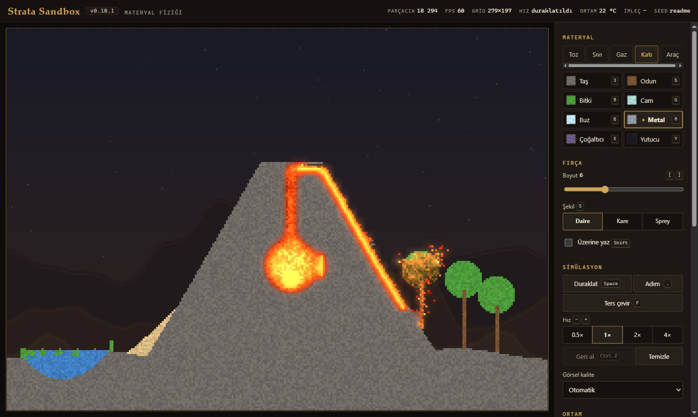
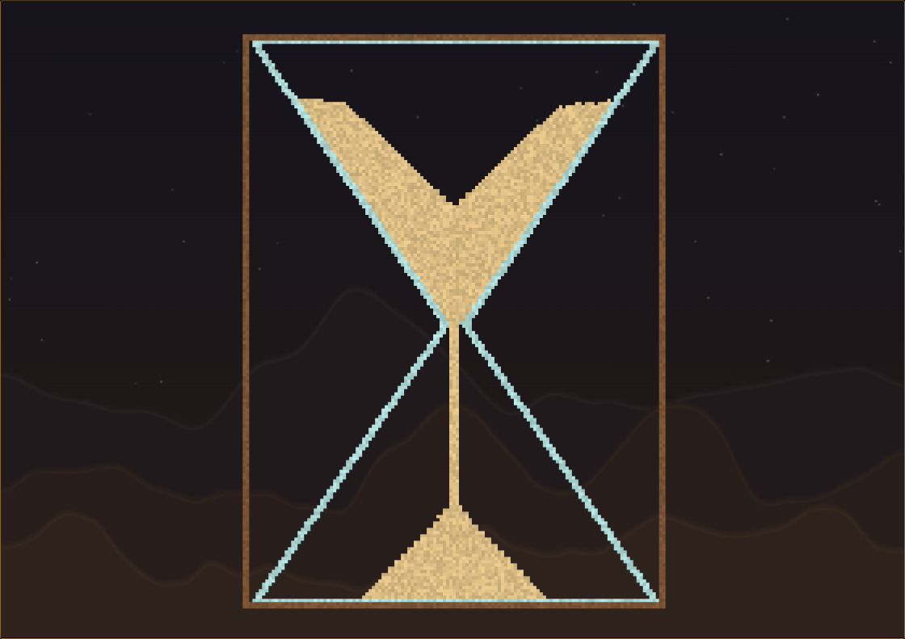
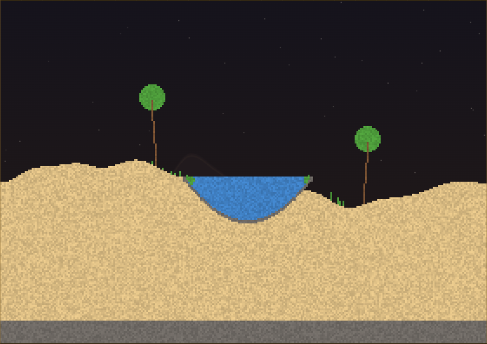
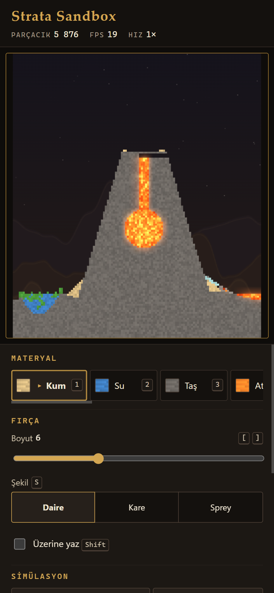
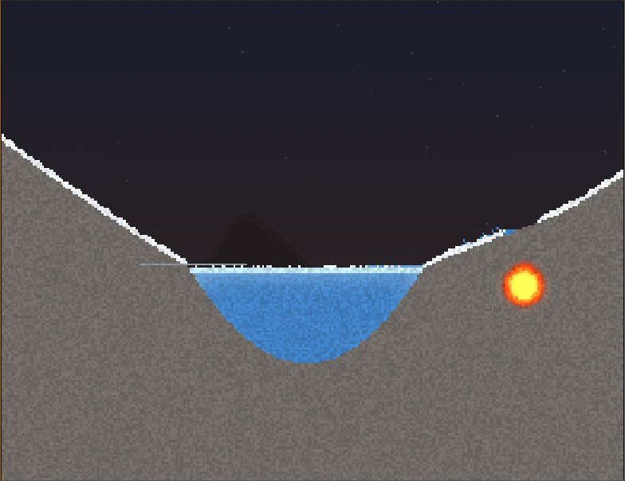
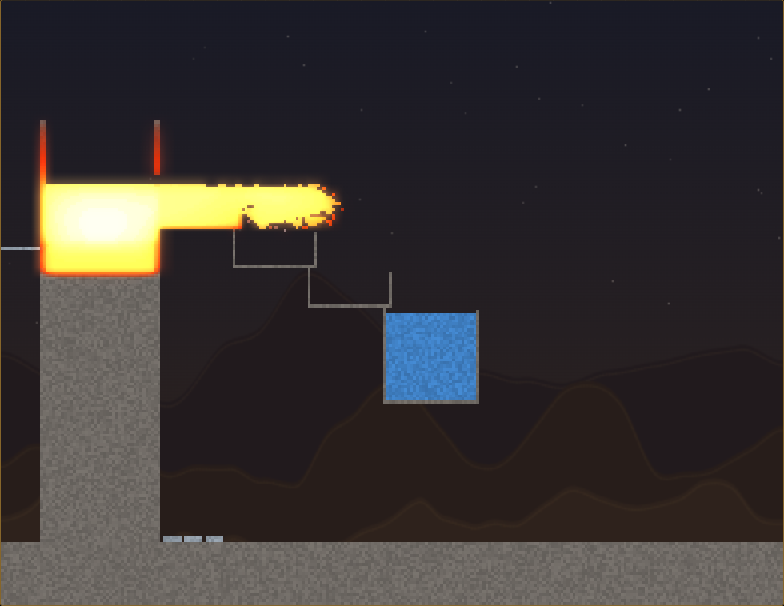
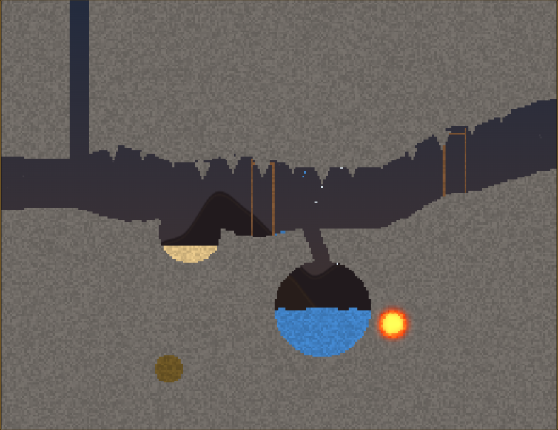

# Strata Sandbox

Tarayıcıda çalışan, grid tabanlı bir **materyal ve fizik sandbox'ı**. Kum, su, yağ, lava, ateş, buhar, bitki ve daha fazlasını simülasyon alanına çizip birbirleriyle nasıl etkileştiklerini izleyebilirsin. Simülasyon gerçek bir cellular automaton'dur: her hücre her tick'te fizik kurallarına göre güncellenir.

- **Canlı sürüm:** <https://kuroiteiken.github.io/StrataSandbox/>
- **Durum:** v0.10.0 — sıcaklık sistemi, yeni materyaller ve sahneler. Uygulamadaki sürüm rozetine tıklayınca tüm sürümlerin yenilikleri listelenir. Ayrıntılar: [docs/DEVELOPMENT.md](docs/DEVELOPMENT.md), tüm materyaller ve etkileşimler: [docs/MATERIALS.md](docs/MATERIALS.md).

## Özellikler

- **Materyaller** (seçicide sekmeler: Toz, Sıvı, Gaz, Katı, Araç):
  - Sand, Water, Stone, Wood, Fire, Steam, Oil, Lava, Plant, Glass
  - Ice, Snow, Metal, Molten Metal
  - Cloner (üstüne dökülen materyali 1000 kez çoğaltır), Sink (değen materyali 1000 kez yutar)
  - Araçlar: Eraser, Isıt, Soğut
- **Ortam ve sıcaklık:**
  - Her hücrenin bir sıcaklığı var ve ısı komşulara iletilir: su kaynar ve donar, lav dış yüzeyinden kabuk bağlar, metal ısıyı hızla iletip kızarır.
  - Ortam sıcaklığı kaydırıcısı (−40…60 °C) ve isteğe bağlı gün/gece döngüsü.
  - Termal görünüm (`T`) ve imlecin altında sıcaklık göstergesi.
- **Fizik:**
  - Yoğunluk tabanlı yer değiştirme: kum suda batar, yağ suda yüzer.
  - Viskoz sıvılar.
  - Yükselen gazlar.
- **Reaksiyonlar:**
  - Lava + Sand → Glass (ısıyla)
  - Lava + Water → Steam ve soğuyan lava → Stone
  - Fire → Wood, Plant ve Oil'i tutuşturur; yeterince ısınan yanıcılar kendiliğinden tutuşur
  - Plant, su yakınında büyür (5 °C altında büyümez)
- **Sahneler:** Volkan, Kum saati (sürekli akar), Vaha, Buzul, Dökümhane, Mağara, Kaos Lab (ve Boş). Seed tabanlıdır; aynı seed aynı başlangıç sahnesini üretir. URL ile paylaşılabilir: `?scene=oasis&seed=abc`.
- **Kontroller:**
  - Brush: Circle, Square, Spray
  - Pause / Step
  - 0.5×–4× hız
  - Undo, Capture (PNG)
- **Performans ve görsel:**
  - Fixed timestep; fizik ekran yenileme hızından bağımsızdır.
  - Heat/bloom efekti ve uyarlanır görsel kalite.
- **Platform:**
  - Mobil ve masaüstü uyumlu.
  - Klavye erişimi.
  - `prefers-reduced-motion` desteği.
  - Backend yok, build adımı yok, runtime dependency yok.

## Kontroller ve kısayollar

> Uygulamadaki "Kısayollar" diyaloğu (`?`) aynı listeyi gösterir.

| Tuş | İşlev |
| --- | --- |
| `1` … `9`, `0` | Sand, Water, Stone, Fire, Wood, Steam, Oil, Lava, Plant, Eraser |
| `G` | Glass |
| `B` `K` `M` `E` | Ice, Snow, Metal, Molten Metal |
| `X` `Y` | Cloner, Sink |
| `H` `C` | Isıt / Soğut fırçası |
| `T` | Termal görünüm |
| `F` | Dünyayı ters çevir |
| `Space` | Pause / Play |
| `.` | Tek tick ilerlet (Step) |
| `[` / `]` | Brush küçült / büyüt |
| `S` | Brush şekli: Circle → Square → Spray |
| `+` / `−` | Simülasyon hızı |
| `Ctrl+Z` / `Cmd+Z` | Son stroke'u geri al |
| Sağ tık | Geçici silgi |
| `?` | Kısayol yardımı |

## Mimari özeti

Proje üç katmandan oluşur. Katmanlar birbirleriyle yalnızca tanımlı API'ler üzerinden konuşur.

- **Physics engine** (`js/engine/`):
  - DOM'a dokunmaz, Node'da da çalışır.
  - Dünya SoA typed array'lerde tutulur.
  - Merkezi materyal tanımları ve derlenmiş lookup tabloları kullanılır.
  - Fixed-timestep tick, seed'li PRNG.
- **Render engine** (`js/render/`):
  - Simülasyon durumunu yalnızca okur.
  - Çizim ImageData + Uint32 palet tablosuyla yapılır ve canvas'a büyütülür.
  - Cache'li procedural arka plan, glow.
- **Uygulama katmanı** (`js/app/`):
  - Pointer ve klavye girişi, panel, istatistikler, tercihler.

Ayrıntılar:

- [docs/ARCHITECTURE.md](docs/ARCHITECTURE.md)
- Teknik kararlar: [docs/DECISIONS.md](docs/DECISIONS.md)
- İlk plan: [docs/PLAN.md](docs/PLAN.md)

## Yerel çalıştırma

Node.js 22+ gerekir. Paket kurulumu yoktur.

```bash
npm run serve   # http://127.0.0.1:8080/
npm test        # tüm testler
```

- ES module'ler `file://` üzerinden çalışmaz; sayfayı bir HTTP sunucusuyla açman gerekir.
- `tools/serve.js` doğru MIME tiplerini gönderen, sıfır bağımlılıklı küçük bir sunucudur.
- Windows'ta `python -m http.server` bazen `.js` dosyalarını yanlış MIME tipiyle sunar. Bu yüzden önerilmez.

- Debug paneli: `?debug=1`.
- Her tick dünya değişmezi kontrolü (yavaş): `?invariants=1`.
- Headless performans ölçümü: `npm run bench`.

## GitHub Pages yayını

- Yayın adresi: <https://kuroiteiken.github.io/StrataSandbox/>
- `main` branch'ine yapılan her push'ta `.github/workflows/pages.yml` çalışır.
- Workflow önce testleri Linux'ta çalıştırır. Linux, büyük/küçük harfe duyarlı olduğu için path hataları burada yakalanır.
- Ardından yalnızca uygulama dosyalarını GitHub Pages'e yayınlar: `index.html`, `css/`, `js/`, `assets/`.
- Repo ayarlarında Pages kaynağı **GitHub Actions** olmalıdır.
- Pull request'lerde yalnızca testler çalışır; yayın yalnızca `main`'den yapılır.
- GitHub Pages dosyaları yaklaşık 10 dakika önbellekler. Yeni yayından hemen sonra eski sürümü görürsen sayfayı zorla yenile (Ctrl+F5).
- Tüm path'ler relative'dir. Bu sayede uygulama `username.github.io/repo-adı/` alt dizininde sorunsuz çalışır.

## Ekran görüntüleri



| Kum saati | Vaha | Mobil |
| --- | --- | --- |
|  |  |  |

| Buzul | Dökümhane | Mağara |
| --- | --- | --- |
|  |  |  |

## Bilinen sınırlamalar

- **Basınç yok:** Sıvılar yalnızca yerel kurallarla akar. U şeklindeki bir boruda iki kol eşitlenmez (cellular automaton sınırlaması).
- **Konveksiyon yok:** Sıcak hava yükselmez, rüzgâr yoktur; ısı yalnızca iletimle yayılır (ADR-014).
- **Basınç yok (0.10.0):** Dolu bir odanın altındaki çoğaltıcı lavı yukarı itemez; patlama ve basınç sonraki alt projede.
- **Undo tek seviyelidir:** Dünyayı son çizimden önceki ana döndürür. Çizimden sonra geçen simülasyon süresi de geri alınır (ADR-010).
- **Grid boyutu açılışta seçilir:** Ekran döndürülünce ya da pencere büyütülünce dünya korunur ama kenarlarda boşluk kalabilir. Yeni boyut için sayfayı yenilemek gerekir.
- **Aynı seed farklı grid boyutunda farklı sahne üretir:** Birebir aynılık (sahne, seed, genişlik, yükseklik) dörtlüsüyle garanti edilir.
- **Yayın önbelleği:** GitHub Pages dosyaları yaklaşık 10 dakika önbellekler. Yeni yayından hemen sonra zorla yenileme (Ctrl+F5) gerekebilir.

## Roadmap

Fazlar ve durumları [docs/DEVELOPMENT.md](docs/DEVELOPMENT.md)'de tutulur:

- Phase 0 — Repository ve iskelet
- Phase 1 — Simulation Core
- Phase 2 — Temel materyaller
- Phase 3 — Reaction System
- Phase 4 — Renderer
- Phase 5 — Input / Brush / Undo
- Phase 6 — UI
- Phase 7 — Procedural sahneler
- Phase 8 — Görsel efektler
- Phase 9 — Mobil / Accessibility
- Phase 10 — Performance
- Phase 11 — GitHub Pages
- Phase 12 — Final QA

- Phase 13 — Sıcaklık sistemi, yeni materyaller ve sahneler (0.10.0)

**Sıradaki alt projeler:**

- Basınç ve patlama: Barut, Duman, Metan, buhar patlaması, volkan patlaması
- Kimya: Asit, Tuz, Tuzlu su
- Toprak ve yaşam: Toprak, Çamur, Tohum

**Diğer fikirler:**

- Electricity
- Dünyayı kaydetme/yükleme ve URL ile sahne paylaşımı
- Özel simülasyon boyutları
- Tam ekran

## Lisans

[MIT](LICENSE)
